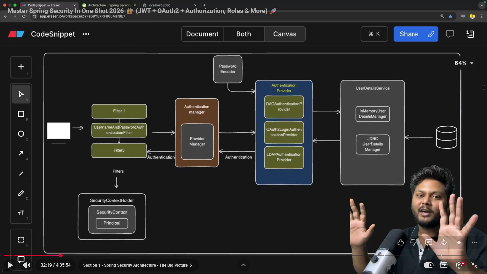

## Swagger-URL
http://localhost:8081/swagger-ui/index.html

### REDIS Cache

```markdown
// commands to install redis-cli in local windows

curl -fsSL https://packages.redis.io/gpg | sudo gpg --dearmor -o /usr/share/keyrings/redis-archive-keyring.gpg    

echo "deb [signed-by=/usr/share/keyrings/redis-archive-keyring.gpg] https://packages.redis.io/deb $(lsb_release -cs) main" | sudo tee /etc/apt/sources.list.d/redis.list    

sudo apt-get update    
sudo apt-get install redis    

sudo service redis-server start    

redis-cli
```

```markdown
// commands to run redis-cli in wsl system command prompt
ping  --> response should be pong    
get CACHE_NAME::CACHE_KEY ---> to print values stored on cache_key    
keys * ---> to print all cache data  
```

### Spring-Security

## Basic Architecture


## config to enable csrf token in swagger
1. Below config will enable authorize button in swagger where we can pass csrf token to authorize our requests.

```yaml
@Bean
    public OpenAPI customOpenAPI() {
        return new OpenAPI()
                .components(
                        new Components()
                        .addSecuritySchemes("csrf",
                                new SecurityScheme().type(SecurityScheme.Type.APIKEY)
                                        .in(SecurityScheme.In.HEADER)
                                        .name(CSRF_TOKEN_HEADER)
                        )
                )
                .addSecurityItem(new SecurityRequirement().addList("csrf"));
    }
```

## Config for in-memory users
```yaml
@Bean
public UserDetailsService userDetailsService(){

    UserDetails userDetailsOne = User
            .withUsername(userOne)
            .password(passwordEncoder().encode(userOnePassword))
            .roles(UserRoles.ROLE_ADMIN.getRole())
            .build();

    UserDetails userDetailsTwo = User
            .withUsername(userTwo)
            .password(passwordEncoder().encode(userTwoPassword))
            .roles(UserRoles.ROLE_USER.getRole())
            .build();

    return new InMemoryUserDetailsManager(userDetailsOne, userDetailsTwo);
}
```